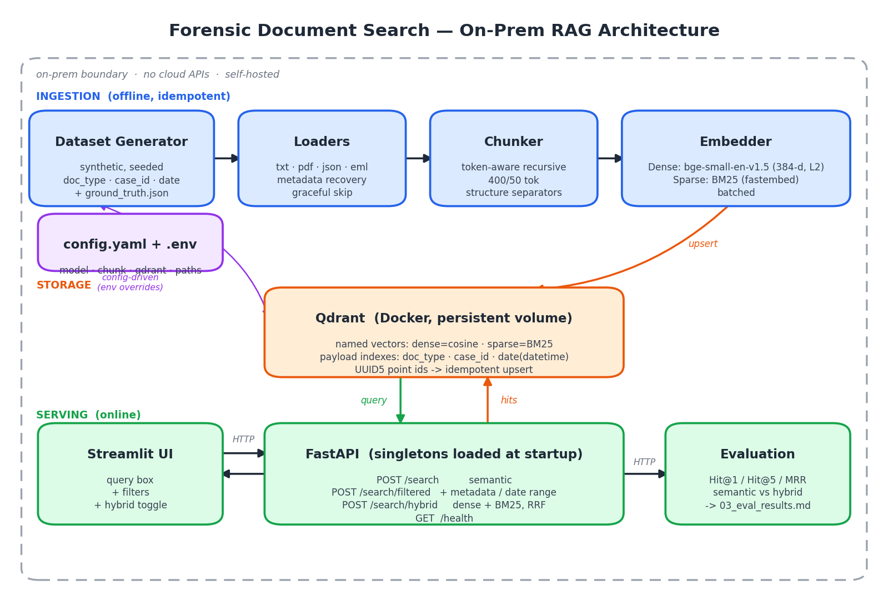

# forensic-doc-search — On-Prem RAG for Forensic Documents

An on-premises Retrieval-Augmented-Generation pipeline for searching forensic case
documents (witness statements, reports, transcripts) by **natural-language query**
and **structured metadata** (doc_type, case_id, date) — with **no cloud APIs** and a
**self-hosted** vector store.

> Built for the Cellebrite GenAI Innovation Team home assignment. Requirements and
> task breakdown: [`docs/01_requirements_and_tasks.md`](docs/01_requirements_and_tasks.md).
> Design & schema: [`docs/02_architecture.md`](docs/02_architecture.md). Component-by-component
> rationale + sources: [`docs/04_design_rationale.md`](docs/04_design_rationale.md).
> Embedder/chunking A/B sweep (we tested the alternatives): [`docs/06_model_sweep.md`](docs/06_model_sweep.md).



## Highlights

- **On-prem & air-gappable** — local `sentence-transformers` embeddings + reranker,
  self-hosted **Qdrant**. No OpenAI/Cohere/Google. `rag fetch-models` warms the cache
  once so `local_files_only` runs need no network.
- **Config-driven** — model, store, chunking, hybrid, reranker all in `config.yaml` /
  `.env` (swap the embedding model with zero code changes).
- **Idempotent ingestion** — deterministic UUID5 chunk ids + Qdrant upsert, with a
  per-`source_file` sweep so re-ingesting an edited (shorter) doc leaves no orphans.
- **Three search modes + reranking** — semantic, metadata-filtered (incl. date ranges),
  and **hybrid** (dense + BM25, server-side RRF); a cross-encoder reranks the top
  candidates of every mode.
- **Honestly measured** — Hit@1 / Hit@5 / MRR with Wilson CIs, per-query-category and
  precision/recall breakdowns, over **paraphrased** (not verbatim) ground-truth queries.

## Quickstart (≤ 3 commands)

> Assumes Python 3.10+ and Docker. For a CPU-only install (smaller/faster), first:
> `pip install torch==2.12.0 --index-url https://download.pytorch.org/whl/cpu`

```bash
pip install -r requirements.txt && pip install -e .   # 1. dependencies
docker compose up -d                                  # 2. self-hosted Qdrant
make run                                               # 3. generate → ingest → serve API
```

`make run` waits for Qdrant, generates the synthetic corpus, ingests it
idempotently, then serves the API at `http://localhost:8000` (`/docs` for OpenAPI).

No `make`? Run the equivalent directly:

```bash
python scripts/wait_for_qdrant.py
rag fetch-models      # (once, online) cache embed/sparse/reranker models for offline use
rag generate          # build data/generated/ + ground_truth.json
rag ingest            # load → chunk → embed → upsert
uvicorn ragforce.api.app:app --host 0.0.0.0 --port 8000
```

> **Air-gapped?** After `rag fetch-models`, set `RAG__EMBEDDING__LOCAL_FILES_ONLY=true`
> to forbid any network call at ingest/serve time.

## API

| Method | Endpoint | Body | Purpose |
|--------|----------|------|---------|
| POST | `/search` | `{query, top_k=5, min_score?}` | Semantic search |
| POST | `/search/filtered` | `{query, filters, top_k=5, min_score?}` | Semantic + metadata filter |
| POST | `/search/hybrid` | `{query, filters, top_k=5, min_score?}` | Dense + BM25 (RRF) |
| GET | `/health` | — | Store stats (chunk_count, collection, model) |

Response: `{"results": [{"chunk_id", "score", "text", "metadata"}]}`. Inputs are
validated (`top_k` 1–100, non-empty query, optional `min_score` 0–1); filters are
allow-listed to indexed fields; a store outage returns **503**, an invalid filter **422**,
and `/health` never throws. Every mode reranks its top candidates with the cross-encoder,
and the optional `min_score` floor drops any hit below that reranker confidence.

## Search UI _(bonus)_

A thin Streamlit client over the API — query box, `top_k` slider, an explicit
**Semantic / Metadata-filtered / Hybrid** mode selector, and a `doc_type` / `case_id`
/ `date` filter panel. Corpus text is rendered as plain text (no markdown injection).
Start the API first, then:

```bash
streamlit run ui/streamlit_app.py     # point at the API via RAG_API_URL (default http://localhost:8000)
```

## Evaluation

```bash
rag eval     # writes docs/03_eval_results.md (per-retriever Hit@1/Hit@5/MRR + breakdowns)
```

Over **30** `(query, expected_document)` pairs whose queries **paraphrase** the planted
signature (lexically disjoint from the source — so this measures retrieval, not verbatim
string matching):

| Retriever | Hit@1 | Hit@5 (95% CI) | MRR |
|-----------|------:|:--------------:|----:|
| Dense (semantic) | 0.47 | 0.60 (0.42–0.75) | 0.527 |
| BM25 (sparse) | 0.70 | 0.93 (0.79–0.98) | 0.783 |
| Hybrid (RRF) | 0.57 | 0.90 (0.74–0.97) | 0.711 |
| **Hybrid + reranker** | **0.73** | 0.90 (0.74–0.97) | **0.813** |

The honest story (not the tidy one): on this small model, **pure dense is weak on
paraphrased queries** (Hit@5 0.40 on the paraphrase subset vs 1.00 on rare-token entity
queries); **BM25 is a strong forensic baseline** (rare names/items); naive RRF fusion
doesn't beat BM25 alone; and the **cross-encoder reranker is the real lever** for ranking
precision (Hit@1 0.57→0.73, best MRR). Metadata filtering: **100% precision, 91% recall**
over 22 filtered queries. Full analysis + per-category table:
[`docs/03_eval_results.md`](docs/03_eval_results.md).

## Project Structure

```
src/ragforce/
  loaders/     txt/pdf/json/eml → Document   (graceful skip on corrupt files)
  chunking/    token-aware recursive splitter (exact char_span provenance)
  embedding/   dense (sentence-transformers) + sparse (fastembed BM25) + cross-encoder reranker
  store/       Qdrant access, collection schema, UUID5 ids + payload (idempotency + orphan sweep)
  pipeline/    ingest orchestrator (load → chunk → embed → upsert, batch-resilient)
  api/         FastAPI: /search, /search/filtered, /search/hybrid, /health (validated, guarded)
  eval/        Hit@K / MRR + Wilson CIs, per-category + precision/recall
  dataset/     synthetic, real-text-seeded corpus generator + ground truth
ui/            Streamlit search UI
config.yaml    primary config   |   .env.example  runtime overrides
docker-compose.yml   self-hosted Qdrant
docs/          requirements, architecture + schema, eval results
```

## Design Decisions (summary)

- **Chunking — token-aware recursive.** Forensic docs are short and paragraph/turn
  structured; recursive splitting respects those boundaries and matches semantic
  chunking on short text at far lower cost. Chunk size is measured with the
  embedding model's own tokenizer and kept under its `max_seq_length` (else text is
  silently truncated). Defaults: 400/50 tokens (bge-small), 200/20 (MiniLM).
- **Embedding — `bge-small-en-v1.5`.** Strong retrieval for its size, MIT-licensed,
  512-token context. Swappable to `all-MiniLM-L6-v2` (the brief's pick) via config.
- **Vector store — Qdrant.** Native sparse vectors + server-side RRF for hybrid,
  payload pre-filtering with datetime ranges for robust metadata filtering, and a
  one-command Docker spin-up.
- **Reranking — `bge-reranker-base` cross-encoder.** First-stage retrieval is
  recall-oriented; the cross-encoder re-reads each (query, passage) pair jointly and
  is the single biggest lever for top-rank precision (see eval). Config-gated, on by
  default, fully local.

Full rationale: [`docs/02_architecture.md`](docs/02_architecture.md).

## Future Work

- Fine-tune the **reranker** on in-domain (query, passage) pairs — the A/B sweep
  ([`docs/06_model_sweep.md`](docs/06_model_sweep.md)) showed a *larger* first-stage
  embedder (`bge-base`, 768-d) does **not** help on this corpus; the cross-encoder is the
  lever, so that's where added capacity pays off.
- Optional local LLM (Ollama) for grounded answer generation over retrieved chunks.
- A held-out, multi-seed eval with relational/temporal query categories for tighter CIs
  (the current n=30 CIs are wide).

## License

MIT (code). Seed text snippets retain their original licenses — see
[`data/README.md`](data/README.md).
